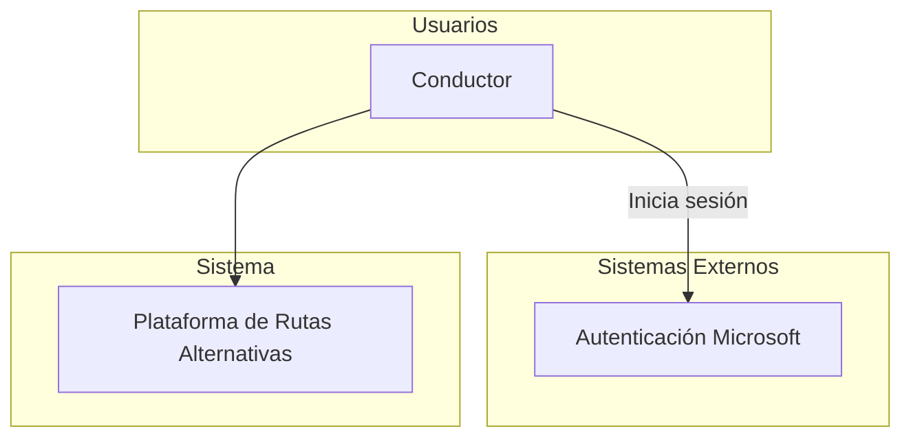
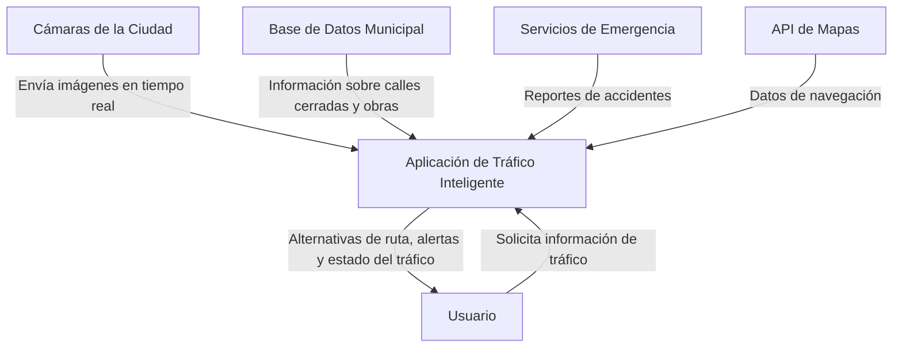

# especificacion de requerimientos de sofware

**proyecto: plataforma para gamificacion a traves  del uso de rutas alternas para la ciudad de bogota**

## ficha documento
| fecha  | version | autor | verificado | observaciones |
|--------|---------|-------|------------|---------------|
|        |         |       |            |               |

## contenido

## 1. Introduccion

TODO: redactar un parrafo donde se de una introduccion al contenido del documento

### 1.1 Proposito

en este documento se definen las especificaciones funcionales y no funcionales de la plataforma de gamificacion sobre el uso de rutas alternativas para la cuidad  de bogota. Este

### 1.2 alcance

### 1.3 personal involucrado
| nombre                  | nicolas garzon                                                                       |
|-------------------------|--------------------------------------------------------------------------------------|
| rol                     | desarrollar el programa                                                               |
| categoria profesional   | ingeniero de sistemas                                                                |
| responsabilidad         | diseñar, desarrollar y implementar el backend del sistema, incluido la base de datos |
| informacion de contacto | nagarzon@ucompensar.edu.co                                                           |

### 1-4 definiciones, acronicos y abreviaturas
| nombre  | descripcion                                       |
|---------|---------------------------------------------------|
| usuario | Personaque usa el sistema para gestionar procesos |
| ERS     | especificacion de requerimientos de sofware       |
| RF      | requerimientos funcionales                        |
| RNF     | requerimientos no funcionales                     |

### 1.5 referencias

### 1.6 resumen

## 2 descripcion general

### 2.1 perspectiva del producto

 
 
 
